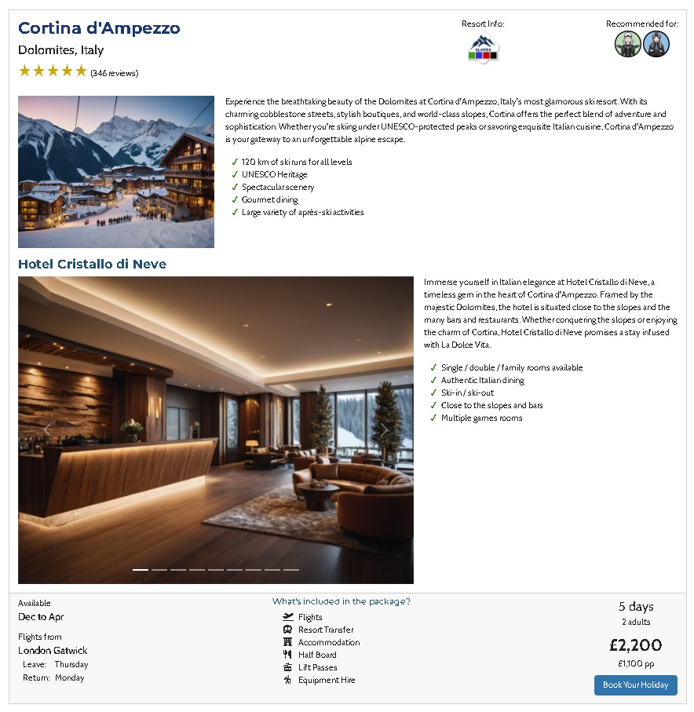

# SkiArise

SkiArise is a (fictitious) company specializing in package ski / snow-boarding holidays. The company wants a website to increase brand awareness and sales.

The [**Project Planning**](project_planning.md) document outlines the business goals of the company and the user stories which were used to inform the development of the website.

You can visit the deployed website <a href="https://lowrycode.github.io/ski-arise-project/index.html" target="_blank" rel="noopener">**here**</a>.
 

# User Experience Design
The following features contribute to a good User Experience (UX):

## 1. Simple Structure and Intuitive Navigation
The website categorises information in just 6 pages:
- **Homepage** - *includes key information about the company and their services*
- **All Packages page** - *lists all the package holidays offered (in alphabetical order)*
- **Info page** - *provides more information about their packages and ski package holidays in general*
- **Booking page** - *includes a form for booking a holiday with the company and leaving contact details for finalising details*
- **Enquiry page** - *includes a form for asking a question and leaving contact details (this feature is to encourage potential customers who are not yet ready to commit to buying a holiday to connect with the company)*
- **Success page** - *when a form is submitted, users are directed to this page to provide feedback that their form was submitted successfully*

Users can easily navigate to these pages through either the top navigation bar or through the contact section in the footer (which are both consistently shown on every page). 

There is also a link to the *About Us* section of the homepage from the top navigation bar.

In addition, there are sometimes links to specific sections of the *All Packages* and *Info* pages when it makes sense to link to these directly within the flow of the content.

## 2. Information Architecture

In addition to how the information is categorised on different pages, information is prioritised with the most important information appearing first.

For example:
- the ordering of items within the top navigation bar reflects the order in which users are likely to be looking for information
- the ordering of sections within the homepage (more details in a later section)
- the keys explaining what icons mean at the top of the all-packages page

## 3. Interaction Design (IXD)

The website follows standard conventions to make it predictable and easy for users to interact with.

For example:
- the navigation bar is positioned at the top of the screen on every page of the website and is consistently presented on all pages
- the hamburger icon is used for revealing and collapsing navigation items on smaller devices
- contact information is found at the bottom of each page and is consistently presented on all pages
- links to external social media platforms are found in the contact section and are presented using the standard icons used by these platforms
- Call To Action (CTA) buttons are positioned in the most obvious places (the top navigation bar and *Contact Us* footer section) and when applicable within the normal flow of content

The website also provides users with feedback when they hover over buttons (with colour changes) or clickable navigation cards (by enlarging), or when they submit a form (by presenting the user with a success message and a link to return to the homepage).

Content hinting is used (i.e. showing the start of the next section just above the fold) so that users know to scroll down for more content. A good example of this can be seen with the start of the popular package section appearing just underneath the hero image / video on the homepage.

## 4. Accessibility

The website is made accessible for those using screen readers through the use of
- semantic HTML
- form labels and grouping similar elements using fieldsets
- alt text for images
- aria labels for icons

The responsive design makes the website accessible on different screen sizes and the use of relative units (rem) for font sizes (rather than fixed units like px) ensures that the fonts scale well with different zoom settings.

There is good colour contrast between text and background colours and a sans-serif font was chosen for body text to ensure that the text is easily readable for users.

## 5. Responsive Design

Wireframes were produced using Balsamiq at the earliest stages of planning to ensure that the website had a good layout on different devices.

***PUT WIREFRAME IMAGES HERE!!!***

## 6. Visual Design

### Media
Since the website was primarily seeking to attract customers to book a ski holiday, images were used extensively across the site showing people smiling in idyllic winter locations with vivid blue skies and pristine white snow. The hero video captures something of the beauty of the motion of skiing.

### Colour Palette
Colours were carefully selected to complement the images and for good visual contrast.

### Typography

Fonts were chosen which gave a professional, modern and friendly impression of the company whilst being easy to read.

For headings, Montserrat (with a fallback to sans-serif) was chosen due to its bold design and its versatility with different font weights. This means it works well for both main section headings and smaller sub-headings, giving a consistency of styling across the whole site.

For the body text, Cabin (with a fallback to sans-serif) was used due to its high legibility and modern look.

The overlay text in the hero image used Merriweather since this was the closest match to the fonts used in the printed advertisements of the company (that appear in the photo of the shop window in the About Us section of the homepage).

### Brand logo

When designing the brand logo, papyrus font was used due to its smooth flowing style and rough edges, reminiscent of a ski slope. The capital "A" was edited (made thicker along the right edge) to look more like a mountain slope and the following "r" was replaced with an illustration of a skier roughly taking the posture of this letter.

### Icons

The website uses icons to show which slopes are available at a given resort and which packages the company recommends for different types of customers.

The icons were designed to be intuitive so that their meaning is immediately clear for the user but this key is shown at the top of the All Packages page to alert users to their purpose.

The colours of these icons were chosen to enhance their meaning. For example, the beginners icon is green because they will want to access the easiest slopes (which are categorised in Europe by the colour green).

## 7. Performance

To ensure that the pages load quickly, all images used on the deployed website were converted to webp format other than those requiring transparency (such as the brand logo and recommendation icons) which were scaled to appropriately sized png files.

A suitable compromise was reached between the resolution of the hero video and its file size to optimise performance.

# Features Overview

## Common Features

The following features are found on all pages of the website.

### Top Navigation bar

On larger screen sizes (laptop and desktop), the full navigation menu is shown.

On smaller screen sizes (mobile and tablet devices), the navigation menu is hidden and a hamburger icon is shown instead. The menu can be expanded and collapsed by touching / clicking on the hamburger icon.

The items are listed in the order of priority that the users are likely to want to visit them and the CTA button is also included here. Clicking on the brand logo also navigates back to the homepage.

The default behaviour of the Bootstrap Navbar is retained (i.e. the hover effects and lighter font showing the active page).

*NOTE: the **About Us** link navigates to a section on the homepage and therefore the navigation bar currently does not collapse automatically on smaller screens when navigating between the **Home** and **About Us** links. This is a bug with the bootstrap library and requires additional javascript to enforce the correct behaviour.*

### Contact Us Section

This section appears in the footer of every page of the website. It includes the primary CTA ("Book Your Holiday") button but also a secondary CTA ("Make An Enquiry") button. The second CTA button is to encourage users who are not yet ready to commit to buying a holiday to connect with the company.

There are also links to the social media pages for the company which open in a new tab (to avoid taking users away from the main site). Since the company does not exist, these links currently just direct to the homepages of each website. The rel="noopener" attribute is used for increased security when navigating to these sites.

### Alternating background colours

On every page of the site, adjacent sections have a subtly different background colour.

This makes it easier for the users to distinguish between different sections of the page as well as improving the aesthetics of the website.

## Homepage

### Hero section

To grab the attention of users when they first arrive at the site, they are presented with a short action video of people skiing which transforms into a hero image of an idyllic ski scene. The decision was made to bypass the video on smaller mobile devices and replace it with the hero image for a better experience for mobile users.

The overlay text includes the company logo and advertising slogan in similar formatting to how it appears on their printed advertisements.

### Popular Packages Section

This section was placed immediately after the hero section as it closely links with the primary purpose of the site (to showcase best products and gain new customers).

The layout of this section changes significantly on different screen sizes. The image above shows how it displays on tablet screens.

Headline details about selected packages are presented alongside buttons which take the user to specific sections of the **All Packages** page where further details can be found.

Images are used to increase emotional engagement. The 5 star ratings are included to increase the credibility of the business and gain the trust of potential customers. The recommendation icons assist users in quickly identifying which packages are most suitable for them.

*NOTE: the decision was made to not include the icons key here to prevent the homepage from becoming too cluttered. At the point when users start looking more deeply at the website, they will come across the meanings of these icons both in the key at the top of the All Packages page and also in the relevant sections of the Learn More page. If they are using a laptop, they will also see descriptive titles appear when they hover over the icon.*

### Learn More Section

This section logically follows the previous section as it allows users to quickly find the information they are looking for.

Each card includes a key word and related image to grab the attention of the user. On hovering over the card, it expands slightly to indicate to the user that it is clickable. On touching / clicking on a card, the user is taken to the relevant section of the **Info** page.

This section makes navigating the site very streamlined and intuitive for the user and caters for the main user personas that were identified in the [**Project Planning**](project_planning.md) document.

### FAQs Section

This section logically follows on from the Learn More section and answers specific questions that potential customers may have.

The [**Project Planning**](project_planning.md) document identifies those who have never been on a ski holiday before as a target audience in the company's business strategy. This section is primarily aimed at this group.

All answers are hidden by default which allows users to easily skip over this section if they wish. Answers are easily revealed by clicking on either the caret symbol (down arrow) or question text. 

When a different accordion item is opened, any previously opened items will close. This keeps the section tidy and uncluttered.

On larger screen sizes, the width of the container is made narrower than the default container size.This makes it easier for the user as it prevents the caret symbol from being too far away from the question text and is more aesthetically pleasing.

### About Us Section

One of the key business goals stated in the [**Project Planning**](project_planning.md) document is to *"Gain the trust of potential customers by demonstrating their legitimacy as a company, their knowledgability / contacts in the industry and their care for customers"*. This is therefore a key section of the website and why it can be accessed directly from the top navigation menu.

The section includes information which highlights their years of experience and contacts in the industry as well as showcasing the awards that the company has received.

Images of the team and the shop are included to further demonstrate the credibility of the business, increase the trust of potential customers and give them an emotional connection with the company.

### Testimonials Section

This section also seeks to increase the trust of potential customers and shows comments from happy customers rotating on a carousel.

The navigation buttons remain hidden until the mouse hovers over the quote (or it is touched on a mobile or tablet device) to give the user control while keeping the section clean and visually appealing.

Testimonials from all of the key target groups are included (e.g. families, snowboarders, first-timers).

## All-Packages Page

This page allows users to browse all the package holidays that the company offers. Users arrive at this page either from the top navigation menu or one of the buttons in the Popular Package section of the homepage.

At the top of the page, users see the main page heading with a supporting description so that users know where they are on the site and what to expect to find on this page. The icon keys are positioned immediately below this.

Information about each of the packages is summarised on a card. It includes further information about the resort and accommodation alongside supporting images.

A custom grid system was used here (rather than just using the regular Bootstrap grid system) to allow for greater control in the positioning of the "tick lists" on different screen sizes. On larger screens, these lists are positioned with the other text to the right of the images whereas on smaller screens they are positioned below the image.

## Info Page

This page provides users with more information about the packages and ski holidays in general. Users arrive at this page either from the top navigation menu or by clicking on one of the cards in the Learn More section of the homepage.

The main purpose of the page is to engage the different types of users, give them confidence that their requirements are understood by the company and that the packages cater well for these requirements. It also reinforces the purpose of the recommendation icons.

## Booking Page

When users click on the primary CTA button ("Book Your Holiday") they are directed to this page. Here they can fill in a form to express interest in one of the packages. 

Rather than paying for the holiday at this stage, the form is intended to be the start of the process where users can outline any specific requirements or preferences they have so that the exact details can be later discussed with a member of the team and the package tailored to their requirements.

The form is organised into two general categories
- **Package Information** - for entering details about which package they want to get and any specific requirements / changes they would like to make
- **Contact Details** - for entering essential contact information, choosing their preferred method of communication and optionally opt-in to news of special offers.

The form inputs include validation. Assuming that all inputs pass these validation checks, the user is directed to the Success page on submission of the form.

Notice the changed appearance of the CTA button in the navigation bar (and footer). This is to show the user that the button has been disabled since they are already on the Booking page.

## Enquiry Page

When users click on the secondary CTA button ("Make An Enquiry") they are directed to this page. Here they can fill in a form leaving their question, contact details, preferred method of communication and optional opt-in to news of special offers.

The purpose of this page is to encourage users who are reluctant to express interest in buying a holiday to connect with the company.

The form inputs include validation. Assuming that all inputs pass these validation checks, the user is directed to the Success page on submission of the form.

Notice the changed appearance of the "Make An Enquiry" button in the footer. This is to show the user that the button has been disabled since they are already on the Enquiry page.

## Success Page

On successful submission of one of the forms, the user is directed to the Success page. This reassures the user that their information has been sent successfully to the company.

There is a button to return to the homepage and the top navigation bar also works as normal for users who prefer this.

# Future Features

The following features could be added in the future:

## Javascript Functionality

The aim of this project was to build a static webpage. Therefore, only the javascript required for Bootstrap elements to function correctly was used in this project.

In the future, the following functionality could be added:
- the ability to search and filter packages on the All Packages page by categories (e.g. recommendation icons)
- the ability to pre-populate the first select input (Resort Name) when users click on the "Book Your Holiday" button from within a particular package card
- a fix for the navigation bar not correctly collapsing for same-page navigation on smaller screens

## Error Page

An Error page could be added so that if a page is not found, the user has an option to return to safety (the homepage).

## Backend

In reality, a backend system would be needed to allow for
- form information to be sent via a POST request (rather than the current GET method)
- customer information to be stored in a secure database

## Additional Content

It would be natural to show multiple images for each ski resort using a carousel. This was not done due to the time taken to generate suitable images but it would make for a better user experience.

The company may decide to continue to expand their business strategy to target larger group bookings. Therefore, the remaining (could-have) User Stories could be implemented.

# Technologies Used

## Website Development

The website mainly uses **HTML**, **CSS** and **BootStrap** but also includes the default **Bootstrap Javascript** file to enable interactive elements (e.g. carousels).

Most of the code was written in a local copy of **Visual Studio Code** to take advantage of the *Live Preview* extension but **Gitpod** (a cloud based environment) was used in the early stages of development, and for sharing the code in mentor meetings and a tutoring session.

**Git** was used as the version control system and all commits were made to the main branch.

**Github** was used to host the Git repository and for deploying the website. **Github projects** was also used for planning and monitoring the development process.

The wireframes were produced using a local copy of **Balsamiq** (which was downloaded from <a href="https://balsamiq.com/" target="_blank" rel="noopener">**here**</a>).

## Images

Most of the images on the website were AI generated images using:
- **Stable Diffusion** (through <a href="https://github.com/ehristoforu/DeFooocus" target="_blank" rel="noopener">**DeFooocus**</a>) - used for most life-like images
- **Adobe Express** - for generating icons which were then manually edited

For further editing and design work, an open source image editor called <a href="https://www.gimp.org/" target="_blank" rel="noopener">**GIMP**</a> was used.

Images were optimised for the website by converting to webp format using the <a href="https://pixelied.com/convert" target="_blank" rel="noopener">**Pixelied**</a> website.

The Favicons were produced using <a href="https://favicon.io/" target="_blank" rel="noopener">**favicon.io**</a> from a custom image.

## Textual Content

Much of the information included on the website is fictitious (including details of the company and accommodations).

I have never been on a ski holiday myself so **ChatGPT** was used to quickly generate information about ski holidays, resorts and the things that different users would want to learn about on the Info page. These responses were then manually edited to fit the context of the website. Since the website is primarily for demonstrating website design, this information was not checked thorougly for accuracy and therefore will likely contain some factual errors.

The fonts came from  <a href="https://fonts.google.com/" target="_blank" rel="noopener">**Google Fonts**</a> and textual icons were from <a href="https://fontawesome.com/" target="_blank" rel="noopener">**Font Awesome**</a>. 

# Testing

# Deployment

# Credits

# Acknowledgments